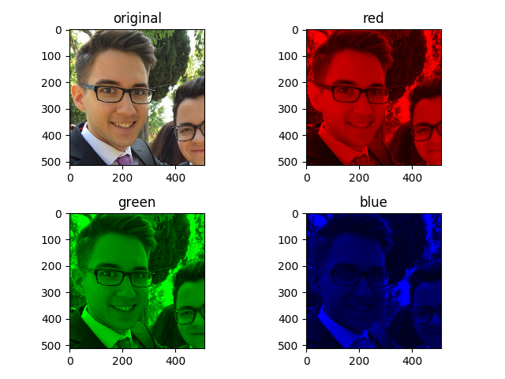
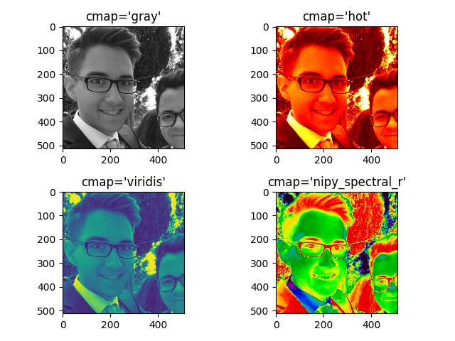

# Image manipulation

This small project takes a given picture and separates the RGB-channels.
Further, it transforms the image to `YCbCr`.
All results are plotted in subplots.

## Usage

Just run `py main.py`.

## Results

Original image

RGB - colored

RGB - grayscale

YCbCr

colormaps

